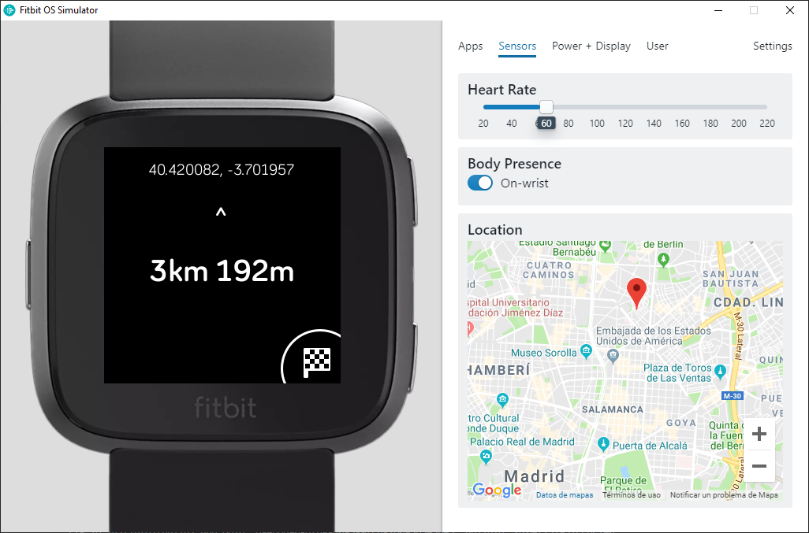

# Geolocator

Plain simple geolocator, with really basic features:

1. Set the current position as a Target.
1. Move around: the watch will show you the distance to the Target.

## Use cases

- Remember a critical place: where is your house or your car.

## To do

### Orientation

There is a lack of compass hardware in Fitit devices, so the idea is to get it from _"the last GPS movement"_, whatever that means.

### Multiple targets

Edit a list of targets from the Settings app in the Companion phone.
Add a _Hub-and-Spoke_ complex app to show a virtual tile list with targets, and select one of them to show the navigator view.
